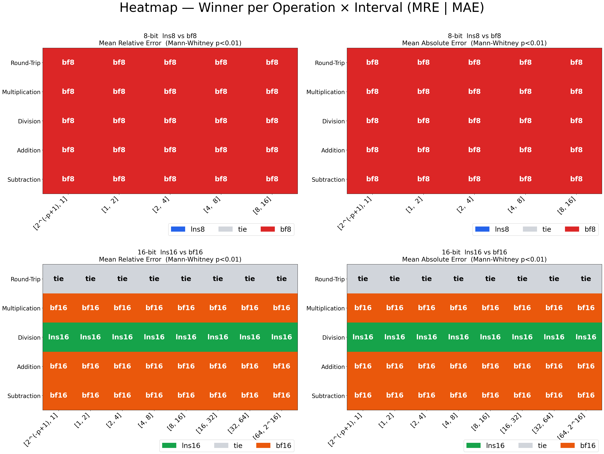
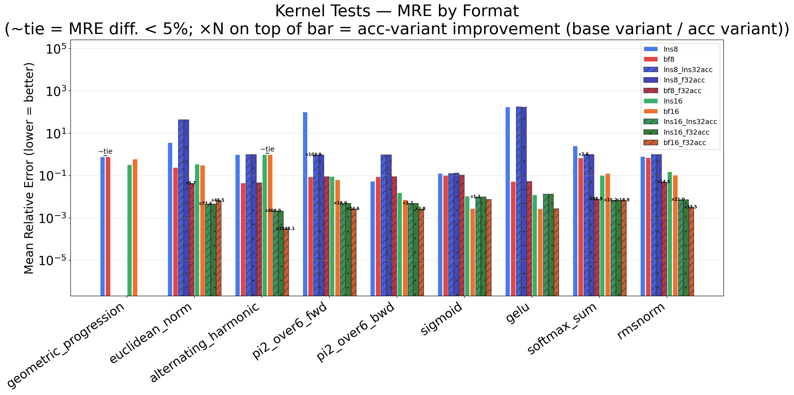
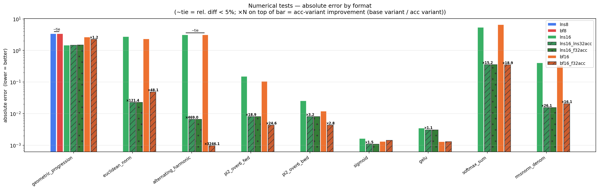

# LNS — Logarithmic Number System Library

A C++ header-only library implementing the Logarithmic Number System (LNS) for
8-, 16-, 32- and 64-bit fixed-point formats, with comparison operators and
FP/BF ↔ LNS conversion, a hardware compiler header targeting custom RISC-V
LNS instructions, and a software simulation API (plus a Brain Float reference
implementation) for testing and development.

---

## What is LNS?

A non-zero real $x$ is represented by a sign bit $S_x$ and a fixed-point,
two's-complement base-2 logarithm $L_x$:

$$S_x = \mathbb{1}[x < 0], \qquad L_x = \log_2(|x|), \qquad x = (-1)^{S_x}\cdot 2^{L_x}$$

$L_x$ has an integer and a fractional part. Negative values of $L_x$
represent magnitudes in $(0,1)$; positive values represent magnitudes in
$(1,+\infty)$ — giving LNS higher representational density in $[-1,1]$,
precisely where the weights of trained neural networks concentrate.

### Operations

| $z$ | $S_z$ | $L_z$ | Condition |
|---|---|---|---|
| $x+y$ | $S_x$ | $L_x + \log_2\left(1+2^{L_y-L_x}\right)$ | $\forall x,y,\ \lvert x\rvert>\lvert y\rvert$ |
| $x-y$ | $S_x$ | $L_x + \log_2\left(1-2^{L_y-L_x}\right)$ | $\forall x,y,\ \lvert x\rvert>\lvert y\rvert$ |
| $x\cdot y$ | $S_x \oplus S_y$ | $L_x + L_y$ | $\forall x,y$ |
| $x \div y$ | $S_x \oplus S_y$ | $L_x - L_y$ | $\forall x,y$ |
| $x^{2^n}$ | $0$ | $L_x \ll n$ | $\forall n>1$ |
| $x^{2^{-n}}$ | $0$ | $L_x \gg n$ | $\forall n>1,\ x\ge 0$ |

Multiplication reduces to an integer add on the exponent field, division to
an integer subtract, and any power-of-two power or root (square, fourth
power, square root, fourth root, …) to a logical shift — all exact up to
quantization, with no mantissa multiplier required in hardware.

### Addition and subtraction

For $z = x \pm y$ with $\lvert x\rvert \ge \lvert y\rvert$:

$$L_z = \log_2\lvert x\pm y\rvert = \log_2\lvert 2^{L_x}\pm 2^{L_y}\rvert = L_x + \log_2\left(1\pm 2^{L_y-L_x}\right)$$

Setting $t = L_y - L_x \le 0$ (always achievable by swapping operands) gives
the **logarithmic Gauss addition function**

$$f^{+}(t) = \log_2\left(1+2^{t}\right), \quad t\in(-\infty,0]$$

and the **logarithmic Gauss subtraction function**

$$f^{-}(t) = \log_2\left(1-2^{t}\right), \quad t\in(-\infty,0)$$

so that $L_z = L_x + f^{\pm}(t)$. Neither function has an exact fixed-point
form — both are approximated via a precomputed piecewise-linear spline
lookup table generated by the `spline` tool (see below).

$f^{+}$ is smooth and bounded on $(-\infty,0]$, so few spline pieces suffice
for high precision. $f^{-}$ diverges to $-\infty$ as $t\to 0^{-}$ and has an
unbounded second derivative near that point — this is the structural reason
$f^{-}$ needs substantially more pieces than $f^{+}$ for the same precision,
and the underlying cause of LNS's known weakness on addition/subtraction.

### Comparisons

Of the five possible orderings ($<,\le,=,\ge,>$), only two need a real
implementation — the rest follow by swapping operands or combining results:

$$
x\le y \iff x \lt y \lor x=y \qquad x\ge y \iff y\le x \qquad x \gt y \iff y \lt x
$$

Equality is a plain bitwise/integer comparison. Less-than is:

$$
\text{LNS-LessThan}(x,y)=
\begin{cases}
\text{true} & \text{sign}(x)=1 \wedge \text{sign}(y)=0\\
\text{exponent}(x) > \text{exponent}(y) & \text{sign}(x)=\text{sign}(y)=1\\
\text{exponent}(x) < \text{exponent}(y) & \text{sign}(x)=\text{sign}(y)=0\\
\text{false} & \text{otherwise}
\end{cases}
$$

### Conversion: FP/BF ↔ LNS

Given $x_{fp}=(-1)^{S_x}(1+m_x)\cdot 2^{e_x-127}$ and $x_{lns}=(-1)^{S_x}\cdot 2^{L_x}$,
equating the two requires $L_x = e_x - 127 + \log_2(1+m_x)$, which defines:

$$\text{float2lns}(S_x,e_x,m_x) := (-1)^{S_x}\cdot\big(e_x - 127 + \log_2(1+m_x)\big)$$

$$\text{lns2float}(S_x, L_{x_i}, L_{x_f}) := (-1)^{S_x}\cdot\big(1+(2^{L_{x_f}}-1)\big)\cdot 2^{L_{x_i}+127}$$

The two nonlinear pieces, $\log_2(1+m_x)$ and $2^{L_{x_f}}-1$, both have
domain $[0,1)$ and are approximated with the same greedy spline construction
used for $f^{+}$ and $f^{-}$.

---

## Why LNS?

**Multiplication and division are exact.** Since values are stored as
exponents, multiplying two LNS numbers is a single integer add on the
exponent field. Division is a subtract. No mantissa multiplier is needed.

**Powers and roots of two are a single shift.** $\sqrt{2^{L_x}}=2^{\frac{L_x}{2}}$, so
square root is an arithmetic right shift of the exponent by one bit — exact
up to quantization, and the same holds for any power-of-two power or root.

**Uniform relative precision.** The quantization step is always the same
fraction of the value across the entire representable range, unlike floating
point which has higher absolute precision near zero.

**Addition and subtraction are the weak point.** Adding two LNS values
requires evaluating the Gauss function $f^{+}(t)=\log_2(1+2^t)$ (or $f^{-}$
for subtraction), which cannot be computed exactly in fixed point and must
be approximated. The quality of this approximation — implemented via spline
lookup tables for lns8 and lns16 — is what the simulation library is designed
to faithfully reproduce; without it, the simulation would not reflect what
the hardware actually computes.

LNS is most attractive for multiply-heavy workloads such as neural network
inference, signal processing filters, and Bayesian computation, where the
hardware savings on multiply significantly outweigh the cost of approximate
addition.

---

## Supported Formats

| Format | $S_x$ (sign) | $L_{x_i}$ (integer) | $L_{x_f}$ (fractional) | Range |
|---|---|---|---|---|
| lns8 Q4.3 | 1 | 4 | 3 | $2^{-8}$ to $2^{7.875}$ |
| lns16 Q8.7 | 1 | 8 | 7 | $2^{-128}$ to $2^{127.992}$ |

lns16 Q8.7 has 7 bits of effective mantissa — the same as bf16 — which is
exactly what makes a direct comparison between the two formats meaningful.

---

## Headers (`lib/`)

### `lns.hpp` — Hardware compiler header

Intended for use when targeting a custom RISC-V processor with native LNS
instructions. Defines the `lns<N>` type and maps arithmetic, comparison, and
`load`/`store` operators to custom RISC-V instruction mnemonics via inline
assembly, using the `.insn` directive to emit custom opcodes directly into
the floating-point register file. This is not meant for simulation — use
`lnssim.hpp` for that.

Predefined type aliases: `lns8`, `lns16`, `lns32`, `lns64`.

### `lnssim.hpp` — Software simulation API

The main API for running LNS computations in software. Defines `lns<N, I, F>`
parameterised by total bit width, integer exponent bits, and fractional
exponent bits. Implements all arithmetic operators (`+`, `-`, `*`, `/`),
comparisons, conversion to/from `float`/`double`, and `exp`/`sinh`/`cosh`/`tanh`.

Concrete instantiations used throughout this repository's benchmarks:

```cpp
using lns32 = lns<32, 8, 23>;  // high-precision reference / accumulator
using lns16 = lns<16, 8, 7>;   // primary Q8.7 format
using lns8  = lns< 8, 4, 3>;   // Q4.3 format
```

For **lns8 and lns16**, addition and subtraction dispatch to the spline LUT
functions in `lnsluts.hpp`, faithfully reproducing the piecewise-linear
approximation that the hardware unit computes. Square root is exact in both
simulation and hardware — since a value is stored as $2^{L_x}$, `.sqrt()` reduces
to an arithmetic right shift of the exponent by one bit, with no table lookup.

For **lns32 and lns64**, spline tables are not feasible — the domain of
$f^{\pm}(t)=\log_2(1\pm2^t)$ grows to a size that makes precomputed piecewise
approximations impractical. These wider formats are therefore emulated using
the `math.h` `log2` and `exp2` functions, which provide a numerically exact
simulation of the LNS arithmetic without modelling any particular hardware
approximation. This makes lns32 and lns64 suitable as a high-precision
reference baseline in benchmarks — for instance, to isolate quantisation
error from conversion error when comparing lns8 or lns16 against a non-float
reference — rather than as a model of a specific hardware implementation.

Must define either `SPLINE_XF` or `SPLINE_XMB` before including
(required for lns8/lns16; ignored for lns32/lns64), and load the
corresponding table files at runtime:

```cpp
#define SPLINE_XMB
#include <lnssim.hpp>

using lns8  = lns< 8, 4, 3>;
using lns16 = lns<16, 8, 7>;

lns8_read_tables ("lib/spline/lns_tables/lns8_q4_3_xmb.lns");
lns16_read_tables("lib/spline/lns_tables/lns16_q8_7_xmb.lns");

lns16 a(1.5f), b(2.0f);
float result  = (float)(a * b);   // exact — integer add on exponents
float result2 = (float)(a + b);   // approximated via spline LUT
float result3 = (float)a.sqrt();  // exact — exp >>= 1

lns_close();
```

After running `sudo make install` from the repository root, headers are
installed flat to your compiler's system include path and can be included
directly using angle brackets:

```cpp
#include <lns>
#include <lnssim>
#include <bfloatsim>
```

### `lnsluts.hpp` — LUT definitions and table I/O

Defines the spline structs and provides `lns8_read_tables` / `lns16_read_tables`
to load precomputed `.lns` table files at runtime, and `lns_close` to free them.
Two spline formats are supported at compile time:

* **`SPLINE_XF`** — stores `(x, f)` pairs, interpolates linearly between function values.
* **`SPLINE_XMB`** — stores `(x, m, b)` per segment, evaluates $m\cdot x+b$ directly. Faster — avoids the division inherent in XF interpolation.

### `bfloatsim.hpp` — Brain Float reference implementation

A self-contained header implementing `bf8` (E4M3) and `bf16` (E8M7) as C++
templates, exposing the same interface as the LNS types so the same
benchmark code can be instantiated over either family. `bf16` is simulated
by truncating the lower 16 bits of an `fp32` representation (round-to-zero);
`bf8` applies the same strategy with the E4M3 mask.

---

## Spline Table Generation

The tool located in `lib/spline/` is a standalone utility that generates the
binary `.lns` table files for lns8 and lns16. It implements a greedy spline
fitting algorithm over $f^{+}(t)=\log_2(1+2^t)$ (add) and $f^{-}(t)=\log_2(1-2^t)$
(sub) for each format, and can test table precision against an error threshold.

Given $`n+1`$ points $`\{(x_k,f_k)\}_{k=0}^{n}`$, the linear spline 
over $`[x_{k-1},x_k]`$ in **XF** form is

$$LS_k(x) = \frac{(x_k-x)f_{k-1}+(x-x_{k-1})f_k}{h_k}, \qquad h_k = x_k-x_{k-1}$$

and the equivalent **XMB** form precomputes a slope and intercept per segment:

$$LS_k(x) = m_k\cdot x + b_k, \qquad m_k = \frac{f_k-f_{k-1}}{h_k}, \qquad b_k = \frac{f_{k-1}x_k-f_kx_{k-1}}{h_k}$$

XMB trades memory for speed: it needs $6(n+1)$ bytes for an lns16 table
versus $4(n+1)$ bytes for XF, but runtime evaluation reduces to a single
multiply-add instead of a division.

The upper bound on linear-spline error is $`\varepsilon \le \frac{1}{8}\max_{[a,b]}\lvert f''(x)\rvert\,h_i^2`$,
which for $f^{+}$ and $f^{-}$ works out to

$$\varepsilon_k^{+} \le \frac{\ln 2\cdot 2^{x_k}\cdot h_k^2}{8(1+2^{x_k})^2}, \qquad \varepsilon_k^{-} \le \frac{\ln 2\cdot 2^{x_k}\cdot h_k^2}{8(1-2^{x_k})^2}$$

A **greedy algorithm** builds each table: starting from the interval
$[-8, 0)$ — the value at $-8$ acting as the lower bound representable by
both lns8 Q4.3 and lns16 Q8.7 — it repeatedly bisects the interval with the
largest estimated error, down to a minimum interval size of $2\cdot 2^{-f}$
($f$ = fractional bits of the format).

Build and generate the default tables:

```bash
cd lib/spline
make
# Generates files inside lib/spline/lns_tables/
```

This updates or produces four files inside `lib/spline/lns_tables/`:

| File | Format | Spline type |
| --- | --- | --- |
| `lns8_q4_3_xf.lns` | lns8 Q4.3 | XF |
| `lns8_q4_3_xmb.lns` | lns8 Q4.3 | XMB |
| `lns16_q8_7_xf.lns` | lns16 Q8.7 | XF |
| `lns16_q8_7_xmb.lns` | lns16 Q8.7 | XMB |

### CLI

```bash
./build/spline <--gen | --test> [config]
```

* **`--gen <+> <-> <f2l> <l2f>`** — exports `.lns` files. Each value is the
  number of rows for that sub-table, in $[2, 1024]$.
* **`--test <max_lines>`** — prints approximation error to stdout for a sweep
  up to `max_lines` rows, in $[2, 1024]$, without writing files.
* **`[config]`** — `--xf` / `--xmb` selects point-pairs vs. slope/intercept
  storage; `--lns16` / `--lns8` selects format width; `<int_digits>` selects
  the number of integer exponent bits (valid range $[4,6]$ for lns8, $[4,14]$
  for lns16).

```bash
# Custom XMB tables for lns16 (Q8.7) with asymmetric sizes: + - f2l l2f, int:8
./build/spline --gen --xmb 128 256 64 64 --lns16 8

# Sweep up to 128 rows for lns8 (Q4.3) in XF mode, without overwriting tables
./build/spline --test --xf 128 --lns8 4
```

---

## Building

From the repository root directory:

```bash
make examples    # builds examples targets

sudo make install   # installs headers flat to system include path
make uninstall      # removes installed headers from system include path
```

---

## Examples

### `examples/bench/` — LNS vs BFloat accuracy benchmark

Monte Carlo arithmetic accuracy benchmark comparing lns8 vs bf8 (E4M3) and
lns16 vs bf16 across five operations (round-trip, mul, div, add, sub),
broken down by operand magnitude interval, with two-sided Mann-Whitney U
significance testing (n = 100 000, p < 0.01, |r| ≥ 0.05). lns8/lns16 errors
are measured against lns32 as a high-precision in-family reference, while
bf8/bf16 errors are measured against fp32 — letting each low-bit format be
compared against a higher-resolution reference within its own family. See
the [bench README](examples/bench/README.md) for full methodology and
execution details.

#### Per-operation winner (Mann-Whitney p < 0.01, n = 100 000)

| Operation | 8-bit winner | 16-bit winner | Reason |
| --- | --- | --- | --- |
| mul | bf8 | bf16 (relative) / lns16 (absolute) | LNS multiply is exact on the exponent, but bf16's mantissa still wins on relative error; lns16 regains the lead on absolute error |
| div | bf8 | lns16 | exact integer subtract on the exponent field gives lns16 the edge across all intervals, in both relative and absolute error |
| add | bf8 | bf16 | IEEE 754 correctly-rounded add; LNS add requires a nonlinear spline correction anchored to input scale |
| sub | bf8 | bf16 | same as add |
| round-trip | bf8 | tie | bf8 slightly better across all intervals; lns16 and bf16 statistically indistinguishable |

At 8-bit, bf8 wins across all tested operations and intervals with no
exceptions, reflecting lns8's coarser exponent grid and the spline
approximation cost at that bit-width. The 16-bit results are more nuanced:
the division advantage for lns16 holds across all intervals under both
relative and absolute error, while the multiplication result splits by
metric — bf16 wins on relative error, but lns16 regains the lead on absolute
error. This split is meaningful: lns16 is preferable when operands stay
within a limited range and absolute fidelity matters; bf16 is preferable
when relative precision has to be preserved across a wide dynamic range.



#### Kernel tests (lns16 vs bf16)




Nine algorithmic kernels are evaluated: geometric progression, Euclidean
norm, the alternating harmonic (Leibniz) series, forward and backward
accumulation of the Basel-problem series for $\pi^2/6$, sigmoid, GELU,
the softmax denominator sum, and RMSNorm — LNS evaluated against lns32, BF
against fp32.

In workloads dominated by addition/subtraction accumulation, base lns16
loses precision to bf16 thanks to bf16's correctly-rounded add. Pairing
lns16 with a 32-bit accumulator (`lns16_lns32acc` or `lns16_f32acc`) recovers
most of that gap, matching or slightly exceeding bf16 in specific kernels
such as RMSNorm. On pure multiplication chains (geometric progression),
lns16 has better precision than bf16, since LNS multiplication stays exact
while bf16's mantissa rounding accumulates; at 8-bit, lns8 is more
competitive and sometimes matches or beats bf8 on the same kernels, though
its 32-bit-accumulator variants don't always help, due to a constant
conversion error between formats. Among the non-linear composite kernels,
lns16 has *higher* error than bf16 on GELU but *lower* error on the softmax
sum — evidence that LNS's relative performance depends on the specific
structure of a function, not just on whether the dominant operation is
addition or multiplication. The 8-bit formats saturate on every kernel
except geometric progression.

### `examples/tinystories/` — TinyStories inference in lns16 and bf16

Runs [Andrej Karpathy's llama2.c](https://github.com/karpathy/llama2.c)
TinyStories inference using lns16 and bf16 as drop-in replacements for the
original float32 weights. Includes weight converters located in `convert/`
for both formats and supports both XF and XMB spline variants for lns16
execution located under `tiny/`.

Because LNS addition error compounds with every summed term, accumulation-
heavy operations — RMSNorm's sum of squares, attention's dot products and
weighted sums, the softmax denominator, matrix multiplication, and the
residual stream — use a hybrid scheme: each scalar multiply stays in pure
lns16 (exact by construction), but the running sum is accumulated in a
wider-precision accumulator and only converted back to lns16 at the end.
`tiny_lns16.cpp` uses an fp32 accumulator; `tiny_lns16_lns32acc.cpp` swaps
this for a simulated lns32 accumulator as a drop-in replacement;
`tiny_bf16.cpp` is the bf16 equivalent, also with an fp32 accumulator.

Direct fp32 → lns16 weight conversion, with no re-training, produces
coherent text on both stories15M and stories42M, in both the XF and XMB
spline variants — these are qualitative spot-checks (one sample per
configuration), so they confirm coherence rather than quantify any accuracy
gap between formats.

See [tinystories README](examples/tinystories/README.md) for step-by-step
build instructions, model download parameters, conversion steps,
and tokenization usage.

---

## RISC-V Hardware Integration

The inline-assembly hardware instructions declared in `lib/lns.hpp` target
the LNS custom functional unit developed for **RISC++**
(a custom RISC-V soft-core design framework developed at [SPeCS](https://specs.fe.up.pt/), INESC TEC / FEUP).

To decouple the core's architecture development from this library,
**the target test suites and toolchain compilation flows reside directly
in the RISC++ core repository.** Once this library is installed on your
system via `make install`, the RISC++ cross-compilation toolchain flags
consume these global headers directly to generate bare-metal ELF validation
binaries and BRAM initialization structures for hardware simulation blocks.

---

## Planned: lns32 and lns64 hardware approximation

lns32 and lns64 are currently available in simulation via `math.h`,
providing an exact LNS reference suitable for benchmarking. Hardware-grade
approximation for these wider formats requires a different strategy from the
spline tables used for lns8 and lns16, as the domain of $f^{\pm}(t)=\log_2(1\pm2^t)$
grows to a size that makes precomputed piecewise tables impractical.

Candidates under development and tracking inside `lib/newtonsdd/`:

* Newton's divided differences with non-uniform sample point placement
* Minimax polynomial approximation (Remez algorithm)
* Piecewise Chebyshev approximation

---

## Author

Henrique dos Santos Teixeira
