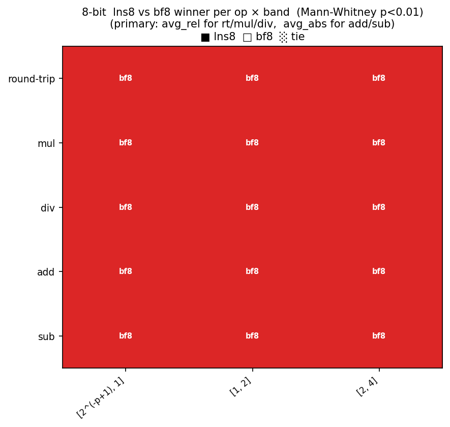
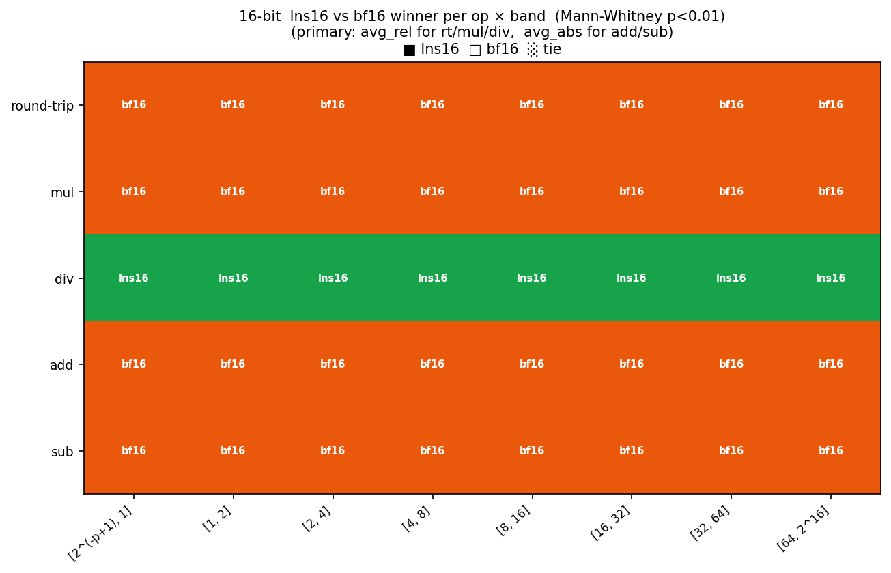
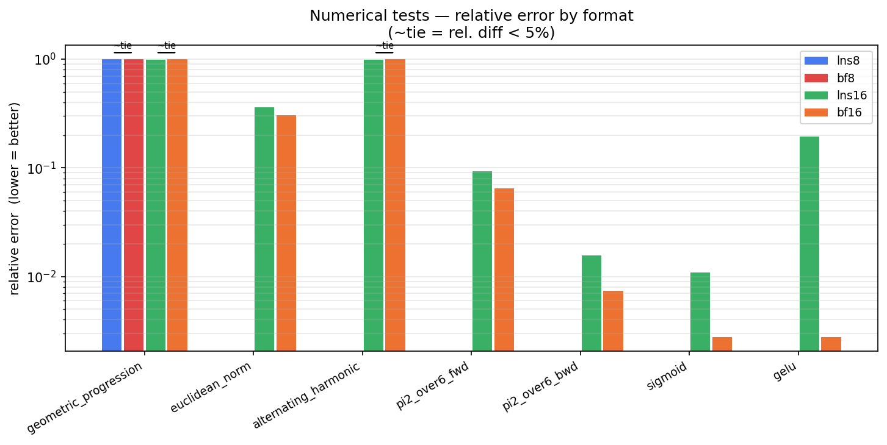

# LNS — Logarithmic Number System Library

A C++ header-only library implementing the Logarithmic Number System (LNS) for 8-bit and 16-bit fixed-point formats, with a hardware compiler header targeting custom RISC-V LNS instructions and a software simulation API for testing and development.

---

## What is LNS?

In LNS, a number is represented as a fixed-point exponent — the value is implicitly `2^e`. Multiplication and division become exact integer additions and subtractions of exponents, with no rounding error beyond quantization. Addition and subtraction require a correction term `log2(1 ± 2^diff)` which is approximated via a precomputed spline lookup table.

The two supported formats are:

- **lns8 Q4.3** — 8-bit, 1 sign bit, 4-bit integer exponent, 3-bit fractional exponent. Representable range: `2^-8` to `2^7.875`.
- **lns16 Q8.7** — 16-bit, 1 sign bit, 8-bit integer exponent, 7-bit fractional exponent. Representable range: `2^-128` to `2^127.992`.

---

## Why LNS?

**Multiplication and division are exact.** Since values are stored as exponents, multiplying two LNS numbers is a single integer add on the exponent field. Division is a subtract. No mantissa multiplier is needed.

**Square root is a single shift.** `sqrt(2^e) = 2^(e/2)`, so square root is an arithmetic right shift by one bit — exact up to quantization.

**Uniform relative precision.** The quantization step is always the same fraction of the value across the entire representable range, unlike floating point which has higher absolute precision near zero.

**Addition and subtraction are the weak point.** Adding two LNS values requires computing `log2(1 + 2^diff)` where `diff` is the difference of the exponents. This cannot be done exactly in fixed point and must be approximated via a lookup table. The quality of this approximation is what the spline tables in this library are designed to maximise.

LNS is most attractive for multiply-heavy workloads such as neural network inference, signal processing filters, and Bayesian computation, where the hardware savings on multiply significantly outweigh the cost of approximate addition.

---

## Repository Structure

```
include/lns/
├── lns.hpp          # Hardware compiler header (RISC-V custom instructions)
├── lns.inl
├── lnssim.hpp       # Software simulation API
├── lnssim.inl
├── lnsluts.hpp      # Spline LUT definitions and table I/O
├── bfloatsim.hpp    # bfloat16 / bf8 software simulation (for comparison)
├── utils.h          # Shared integer type aliases
├── newtonsdd/       # Newton's divided differences tool (for lns32/lns64)
└── spline/          # Spline table generation tool
    ├── src/
    ├── include/
    └── lns_tables/  # Precomputed .lns table files (gitignored, generate locally)

apps/
└── bfloat_vs_lns/   # LNS vs bfloat16/bf8 accuracy benchmark

tests/               # RISC-V test generator and compiled artifacts
```

---

## Headers

### `lns.hpp` — Hardware compiler header

Intended for use when targeting a custom RISC-V processor with native LNS instructions. Defines the `lns<N>` type and maps arithmetic operators to custom RISC-V instruction mnemonics via inline assembly, using the `.insn` directive to emit custom opcodes directly into the floating-point register file. This is not meant for simulation — use `lnssim.hpp` for that.

Predefined type aliases: `lns8`, `lns16`, `lns32`, `lns64`.

### `lnssim.hpp` — Software simulation API

The main API for running LNS computations in software. Defines `lns<N, I, F>` parameterised by total bit width, integer exponent bits, and fractional exponent bits. Implements all arithmetic operators (`+`, `-`, `*`, `/`) and conversion to/from `float`.

Addition and subtraction dispatch to the spline LUT functions in `lnsluts.hpp`. Square root is exact — since a value is stored as `2^e`, `.sqrt()` reduces to an arithmetic right shift of the exponent by one bit, with no table lookup.

Must define either `SPLINE_XF` or `SPLINE_XMB` before including, and load the corresponding table files at runtime:

```cpp
#define SPLINE_XMB
#include <lnssim.hpp>

using lns8  = lns<8,  4, 3>;
using lns16 = lns<16, 8, 7>;

lns8_read_tables ("include/lns/spline/lns_tables/lns8_q4_3_xmb.lns");
lns16_read_tables("include/lns/spline/lns_tables/lns16_q8_7_xmb.lns");

lns16 a(1.5f), b(2.0f);
float result  = (float)(a * b);   // exact — integer add on exponents
float result2 = (float)(a + b);   // approximated via spline LUT
float result3 = (float)a.sqrt();  // exact — exp >>= 1

lns_close();
```

After `make install`, headers are installed flat to the system include path and can be included with angle brackets:

```cpp
#include <lnssim.hpp>
#include <lnsluts.hpp>
```

### `lnsluts.hpp` — LUT definitions and table I/O

Defines the spline structs and provides `lns8_read_tables` / `lns16_read_tables` to load precomputed `.lns` table files at runtime, and `lns_close` to free them. Two spline formats are supported at compile time:

- **`SPLINE_XF`** — stores `(x, f)` pairs, interpolates linearly between function values.
- **`SPLINE_XMB`** — stores `(x, m, b)` per segment, evaluates `m*x + b` directly. Faster — avoids the division inherent in XF interpolation.

---

## Spline Table Generation

`include/lns/spline/` is a standalone C++ tool that generates the binary `.lns` table files. It implements a greedy spline fitting algorithm over `log2(1 + 2^x)` (add) and `log2(1 - 2^x)` (sub) for each format, and can also test table precision against an error threshold.

Build and generate the default tables:

```bash
cd include/lns/spline
make
make tables
```

This produces four files in `lns_tables/`:

| File | Format | Spline type |
|---|---|---|
| `lns8_q4_3_xf.lns`   | lns8 Q4.3  | XF  |
| `lns8_q4_3_xmb.lns`  | lns8 Q4.3  | XMB |
| `lns16_q8_7_xf.lns`  | lns16 Q8.7 | XF  |
| `lns16_q8_7_xmb.lns` | lns16 Q8.7 | XMB |

To test precision without generating:

```bash
./build/spline --test --xmb 128 --lns16 8
```

---

## Building

From the repo root:

```bash
make apps    # build apps/bfloat_vs_lns
make tests   # compile RISC-V test artifacts
make all     # both

make install    # install headers to system include path
make uninstall  # remove installed headers
```

---

## Applications

### `apps/bfloat_vs_lns/` — LNS vs BFloat accuracy benchmark

Monte Carlo arithmetic accuracy benchmark comparing lns8 vs bf8 (E4M3) and lns16 vs bf16 across five operations (round-trip, mul, div, add, sub), broken down by operand magnitude band, with Mann-Whitney significance testing on 100k samples per cell. See the [bench README](apps/bfloat_vs_lns/bench/README.md) for full methodology and results.

#### Per-operation winner (Mann-Whitney p < 0.01, n = 100 000)

| Operation | Winner | Reason |
|-----------|--------|--------|
| mul | BF | LNS round-trip quantisation noise outweighs its exact-exponent-add property at these bit widths |
| div | **LNS16**/BF8 | Exact integer subtract on the exponent field; BF must round a full mantissa quotient |
| add | BF | IEEE 754 correctly-rounded add; LNS add is anchored to input scale via spline approximation |
| sub | BF | Same as add |
| round-trip | BF | BF slightly better across all bands |

The div advantage holds across all bands and both bit-widths with no exceptions.





#### Numerical tests (lns16 vs bf16)



bf16 wins on all workloads involving accumulation or activation functions (pi²/6, sigmoid, GELU). Both formats fail on the alternating harmonic series (severe cancellation) and geometric progression (dynamic range exhaustion at 8-bit).

### RISC-V test suite (`tests/`)

Generates and compiles LNS16 arithmetic test cases for bare-metal RISC-V, producing ELF binaries and BRAM initialisation headers (`.h`) for hardware simulation. This is part of the LNS functional unit integration into **RISC++**, a custom RISC-V soft-core being developed at [SPeCS](https://specs.fe.up.pt/), INESC TEC / FEUP.

---

## Planned: lns32 and lns64

The spline table approach used for lns8 and lns16 becomes impractical at wider formats — the domain of `log2(1 ± 2^x)` grows significantly and table sizes explode. A different approximation strategy is needed.

Candidates under consideration: Newton's divided differences with non-uniform sample point placement, minimax polynomial approximation (Remez algorithm), and piecewise Chebyshev approximation. Work on this has not started yet.

---

## Models

```
wget https://huggingface.co/karpathy/tinyllamas/resolve/main/stories42M.bin
wget https://huggingface.co/karpathy/tinyllamas/resolve/main/stories15M.bin
wget https://huggingface.co/karpathy/tinyllamas/blob/main/stories260K/stories260K.bin
wget https://github.com/karpathy/llama2.c/raw/master/tokenizer.bin
wget https://huggingface.co/karpathy/tinyllamas/blob/main/stories260K/tok512.bin
```

---

## Author

Henrique dos Santos Teixeira
