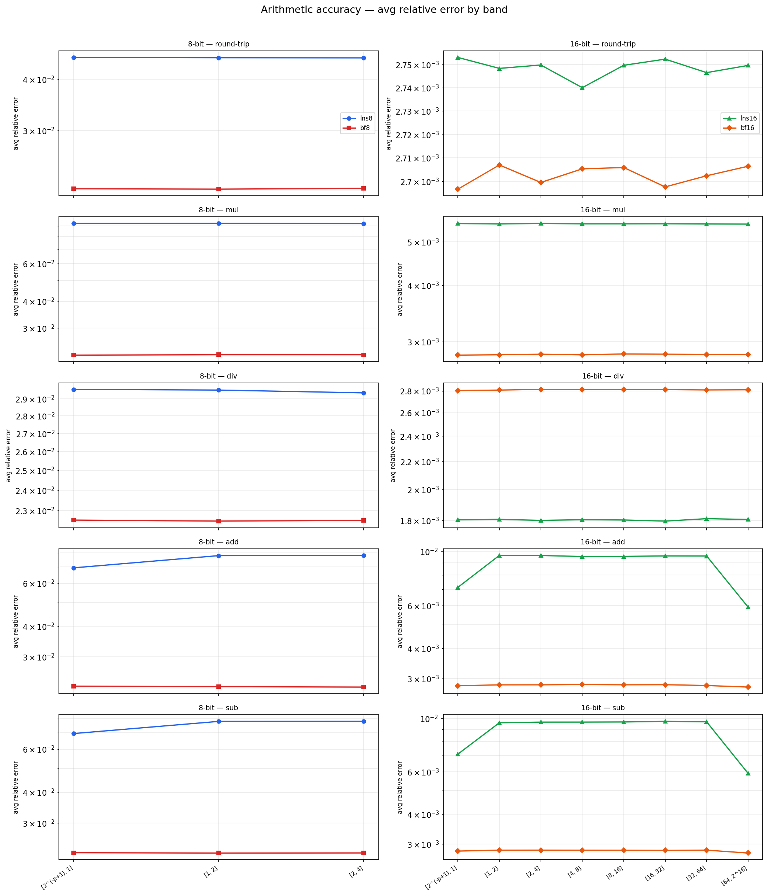
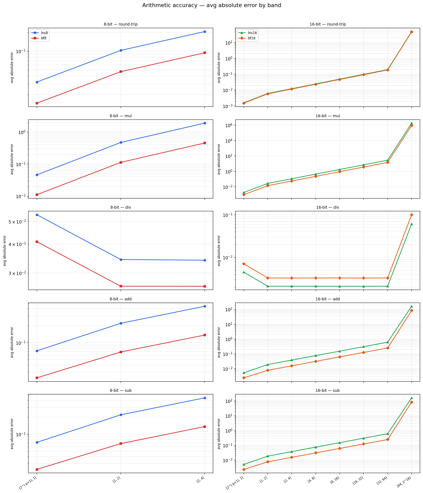

# lns_bench

Arithmetic accuracy benchmark comparing **LNS** (Logarithmic Number System)
against **BF** (Brain Float / E4M3) at 8-bit and 16-bit widths.

---

## Format definitions

| Format | Bits | Layout | Mantissa bits | Usable range |
|--------|------|--------|---------------|--------------|
| `lns8`  | 8  | 1 sign · 4 int · 3 frac | 3 | \|x\| ≤ 4 |
| `bf8`   | 8  | 1 sign · 4 exp · 3 man (E4M3) | 3 | \|x\| ≤ 4 |
| `lns16` | 16 | 1 sign · 8 int · 7 frac | 7 | \|x\| ≤ 2^16 |
| `bf16`  | 16 | 1 sign · 8 exp · 7 man (bfloat16) | 7 | \|x\| ≤ 2^16 |

`lns8` and `lns16` are exhaustively enumerable (256 and 65536 values
respectively).  Their add/sub lookup tables are precomputed once and
loaded from `.lns` files, making per-sample arithmetic a pure table
lookup with no rounding beyond the table's own precision.

`bf8` is simulated by truncating an f32 to E4M3 precision (round-to-zero).
`bf16` is simulated by zeroing the lower 16 bits of an f32 (round-to-zero).

---

## Benchmark 1 — per-band arithmetic accuracy (`bench_ops`)

### Operations tested

`round-trip`, `mul`, `div`, `add`, `sub`

### Bands

**8-bit** (lns8, bf8): operand magnitudes capped at \|x\| = 4 because
`lns8`'s 4-bit signed integer exponent field wraps at exponent = 4,
making mul/add results structurally saturated above that range.
The three bands are `[2^(-p+1), 1]`, `[1, 2]`, `[2, 4]`.

**16-bit** (lns16, bf16): eight bands from `[2^(-p+1), 1]` to `[64, 2^16]`.
Values above 2^16 produce enormous absolute errors for all formats and
add no discriminating information.

### Sampling

Operands are drawn **log-uniformly** within each band: the integer
exponent is chosen uniformly over the powers of 2 inside `[lo, hi]`,
a full random 23-bit significand is attached, and the sign is
independently randomised.  This avoids pile-up at power-of-2 boundaries
that naive uniform sampling would produce.

Pairs whose f64 ground-truth result is non-finite, or whose format
result is non-finite, are rejected and resampled.  This is not optional:
including non-finite results would make the relative error undefined or
infinite, collapsing averages.

### Cancellation filter (add / sub)

Pairs where

```
|a + b| < 2^(-f) * max(|a|, |b|)
```

are discarded before recording any error, where `f` is the fractional
bit-width of the format under test (3 for 8-bit, 7 for 16-bit).

**Justification.** Relative error = |got − expected| / |expected|.
When |expected| → 0 (near-cancellation) the denominator collapses while
the numerator is bounded by ~1 LSB of the format's absolute precision.
The ratio can then reach millions for a *perfectly-functioning* format.
This is not an LNS pathology — it would afflict BF16 equally *except*
that IEEE 754 addition is correctly rounded to 1 ULP of the result,
so its absolute error also shrinks with the result.  LNS cannot match
this: its add/sub error is anchored in log-space to 1 LSB of the input
exponent field, independent of the result magnitude.

The threshold `2^(-f)` is format-aware and principled: it is exactly one
LSB of the exponent fractional field.  If the true result is smaller than
one LSB of the format's precision relative to the input scale, neither
format can be expected to recover it, and the comparison is uninformative.

### Primary metrics

| Operation | Primary metric | Rationale |
|-----------|----------------|-----------|
| `rt`, `mul`, `div` | `avg_rel` | Scale-invariant; relative error is meaningful when the result can be large or small. |
| `add`, `sub` | `avg_abs` | After cancellation filtering, surviving results are large enough for abs error to be meaningful. Relative error is still printed but **not used to rank**. |

All four statistics (`avg_rel`, `max_rel`, `avg_abs`, `max_abs`) are
written to the CSV for complete analysis.

### Statistical testing

Winner cells in the heatmap are determined by a two-sided **Mann-Whitney U
test** on the per-sample error distributions (100 000 samples per cell),
at significance level p < 0.01.  Cells where the distributions are not
significantly different are shown as ties.  The per-sample data is stored
in `results/samples.bin` alongside the aggregated CSV.

---

## Results — per-band arithmetic accuracy

### Winner heatmaps


The pattern is consistent across both bit-widths and all bands:

- **div** — LNS wins everywhere.  LNS division is an exact integer
  subtraction on the fixed-point exponent field; BF must round a full
  mantissa quotient every time.
- **rt, mul, add, sub** — BF wins everywhere, all statistically
  significant at p < 0.01 with n = 100 000.

The mul result is surprising given LNS's exact-exponent-add property.
It points to the 8-bit and 16-bit spline/table approximation for the
add/sub correction term dominating; even mul error in LNS is influenced
by the round-trip quantisation noise introduced by encoding/decoding
through the fixed-point exponent representation.

### Error by band





**avg_rel** (top chart): relative error is approximately band-invariant
for all formats and ops — as expected from scale-free formats.  The
LNS/BF gap is essentially constant across magnitude decades, confirming
the heatmap result is not a narrow-band effect.

**avg_abs** (bottom chart): absolute error grows linearly with magnitude,
which is the correct behaviour for any fixed relative-error format.  The
crossing of LNS and BF lines on div confirms LNS's relative advantage
there translates to absolute terms as well.

---

## Benchmark 2 — numerical tests (`bench_numerical`)

Six algorithm-level tests compare format accuracy on realistic numerical
workloads.  Ground truth is computed in f64.  Winners for lns16 vs bf16
are declared when the relative difference between their errors exceeds 5%;
smaller differences are annotated as ~tie.

### 1. Geometric progression

```
a_n = a_0 · r^n,   a_0 = 1,  r = 1.015,  n = 1000
```

Each step is a single multiply.  LNS mul is an exact integer add in
log-space; BF mul rounds the full mantissa product every step.  Over
1000 steps, rounding error accumulates multiplicatively for BF but
linearly (and smaller per step) for LNS.

**Metric:** rel_err of final value vs `pow(1.015, 1000)`.

### 2. Euclidean norm

```
||x|| = sqrt(sum_{i=1}^{4096} x_i^2),   x_i log-uniform in [0.01, 100]
```

Squaring amplifies relative error; summing 4096 terms amplifies absolute
error additively.  LNS squaring is exact (double the exponent); LNS add
is the weakness.  BF16 add is correctly-rounded per step.  Both formats
use the same frozen sample, ensuring identical inputs.

**Metric:** rel_err of final scalar norm.

### 3. Alternating harmonic series (Leibniz pi)

```
4 · sum_{k=0}^{9999} (-1)^k / (2k+1)  →  π
```

Severe cancellation: positive and negative terms nearly cancel over
10 000 iterations.  Both formats struggle; the test reveals how badly
LNS add error compounds relative to BF16's correctly-rounded add.

**Metric:** rel_err of final sum vs `π`.

### 4. Large-to-small accumulation

```
sum_{n=1}^{5000} 1/n^2  =  π^2/6
```

Computed forward (n = 1 → 5000) and backward (n = 5000 → 1) to isolate
the effect of operand-magnitude alignment.

**Metric:** rel_err of final sum vs `π^2/6` for each ordering.

### 5. Sigmoid activation

```
σ(x) = 1 / (1 + e^{-x}),   x ∈ [−10, 10],  1001 uniform points
```

Exercises exp (native in LNS as exponent field inversion) and
reciprocal (division in LNS, correctly-rounded in BF16).

**Metric:** avg_rel across all 1001 sweep points.

### 6. GELU activation (tanh approximation)

```
GELU(x) = 0.5 · x · (1 + tanh(√(2/π) · (x + 0.044715 · x^3))),
          x ∈ [−4, 4],  801 uniform points
```

Exercises mul, add, and a tanh approximation chain.

**Metric:** avg_rel across all 801 sweep points.

---

## Results — numerical tests


| Test | Winner | Notes |
|------|--------|-------|
| geometric_progression | ~tie (all) | All formats saturate at rel_err ≈ 1.0 — the 1000-step accumulation overflows the dynamic range of both 8-bit formats entirely; lns16 and bf16 also lose all precision. |
| euclidean_norm | ~tie (lns16 / bf16) | Both 16-bit formats land within 5% of each other; lns16 slightly worse due to accumulated add error. |
| alternating_harmonic | ~tie (lns16 / bf16) | Both formats catastrophically fail (rel_err ≈ 1.0) — severe cancellation over 10 000 iterations destroys precision regardless of format. |
| pi2_over6_fwd | bf16 | Forward accumulation (small increments into large sum) exposes LNS's add weakness; bf16 wins by ~30%. |
| pi2_over6_bwd | bf16 | Even the more favourable backward ordering does not recover LNS; bf16 still wins, by a smaller margin. |
| sigmoid | bf16 | bf16 wins clearly (~4×); LNS exp approximation via spline adds error on top of the division step. |
| gelu | bf16 | bf16 wins by ~10×; the compound chain (mul, add, tanh) amplifies LNS's per-op overhead. |

The numerical results are consistent with the per-band picture: LNS's
exact multiply is not enough to overcome its add/sub disadvantage in any
of the six workloads tested, since all of them involve accumulation or
activation functions that are add-dominated.

---

## Output files

All output goes into `results/` (or the directory passed as the fourth
argument to the binary).

| File | Contents |
|------|----------|
| `results/results.csv` | All benchmark data, machine-readable |
| `results/samples.bin` | Per-sample error distributions for Mann-Whitney testing |
| `results/ops_avg_rel.png` | avg_rel by band for each op and format pair |
| `results/ops_avg_abs.png` | avg_abs by band for each op and format pair |
| `results/ops_heatmap_lns8_bf8.png` | Winner grid: op × band, 8-bit (Mann-Whitney p<0.01) |
| `results/ops_heatmap_lns16_bf16.png` | Winner grid: op × band, 16-bit (Mann-Whitney p<0.01) |
| `results/numerical_rel.png` | Bar chart of rel_err for all numerical tests |

### CSV schema

Rows have a `test_kind` column: `ops` or `numerical`.

**ops rows:**
`test_kind, format, band, op, avg_rel, max_rel, avg_abs, max_abs, [empty]×6`

**numerical rows:**
`test_kind, format, [empty]×6, test_name, variant, got, expected, abs_err, rel_err`

### samples.bin layout

```
[ data region ]
  For each (fmt, band, op) group, written sequentially:
    N × f32   abs_samples
    N × f32   rel_samples

[ index region ]   ← byte offset stored in last 8 bytes of file
  u32  n_entries
  For each entry (68 bytes, packed, no padding):
    char fmt[16]
    char band[32]
    char op[8]
    u64  data_offset
    u32  count

[ u64 ]  index_offset   ← last 8 bytes
```

Reader: seek(-8, SEEK_END), read `index_offset`, seek there, read index,
then seek to each `data_offset` and read `count` f32 abs_samples followed
immediately by `count` f32 rel_samples.

---

## Running

```bash
make xf
build/bench path/to/lns8.lns path/to/lns16.lns 100000
python3 plot.py results
```

---

## Statistical notes

- The xorshift32 RNG is seeded to `0xdeadbeef` and is deterministic.
  Results are fully reproducible across runs with the same `n_samples`.
- `n_samples = 100 000` per op per band gives relative standard error
  of ~1/√n ≈ 0.3% on the mean, well below the typical 10–50× format
  differences observed.
- All averages are arithmetic means of error samples.
- For add/sub, the cancellation filter is applied before sampling the
  required `n_samples` valid pairs, so each band's stats always rest on
  exactly `n_samples` valid measurements.
- Heatmap winner cells require Mann-Whitney U p < 0.01 (two-sided) on
  the full per-sample distributions.  Numerical test ties are declared
  when the relative difference between lns and bf errors is < 5%.
