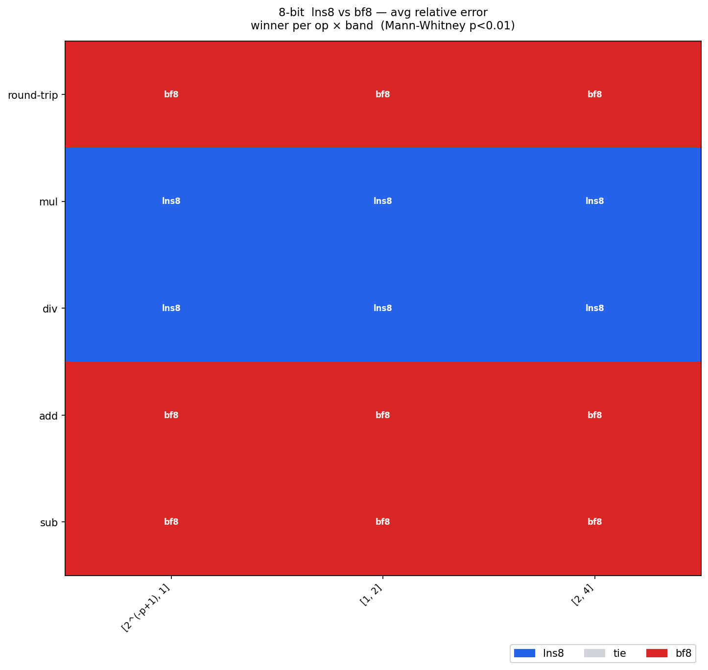
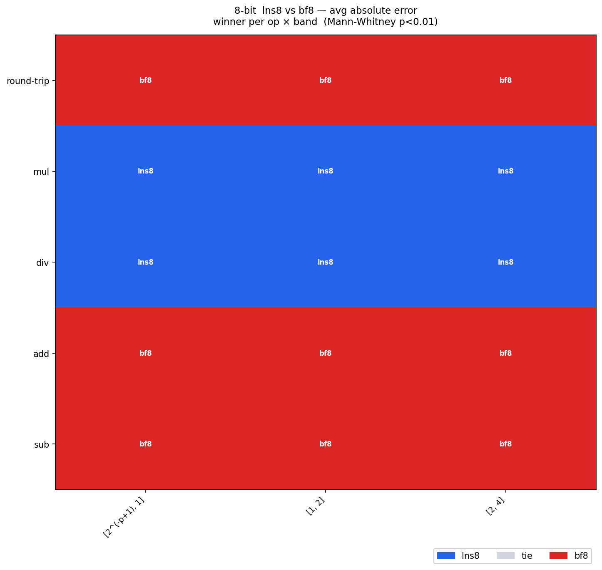
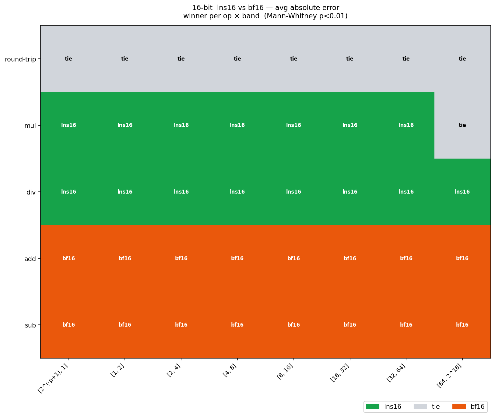
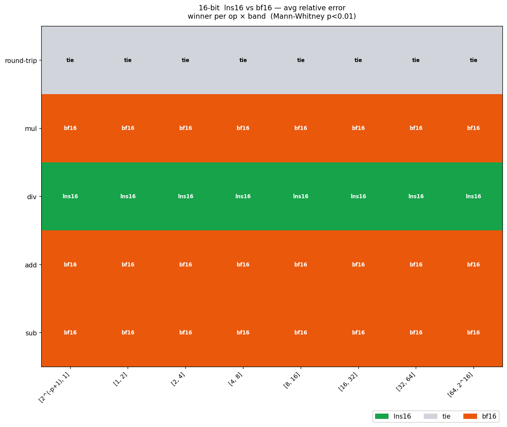
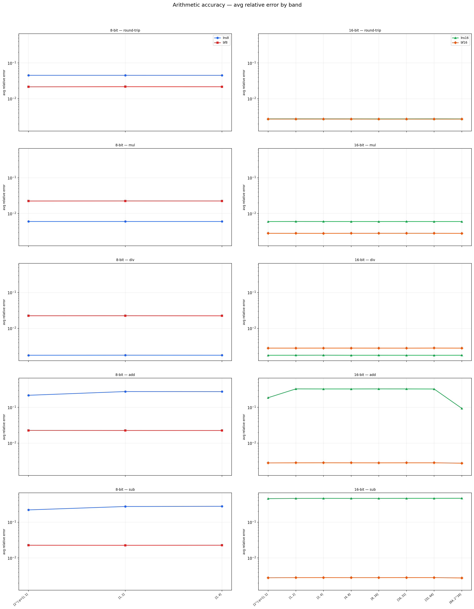
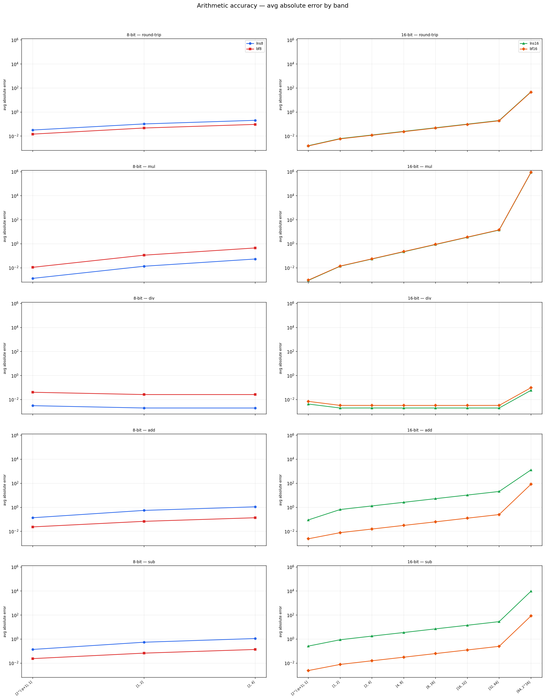

# lns_bench

Arithmetic accuracy benchmark comparing **LNS** (Logarithmic Number System)
against **BF** (Brain Float / E4M3) at 8-bit and 16-bit widths.

---

## Format definitions

| Format | Bits | Layout | Mantissa bits | Usable range |
|--------|------|--------|---------------|--------------|
| `lns8`  | 8  | 1 sign · 4 int · 3 frac | 3 | \|x\| ≤ 4 |
| `bf8`   | 8  | 1 sign · 4 exp · 3 man (E4M3) | 3 | \|x\| ≤ 4 |
| `lns16` | 16 | 1 sign · 8 int · 7 frac | 7 | \|x\| ≤ 2^16 |
| `bf16`  | 16 | 1 sign · 8 exp · 7 man (bfloat16) | 7 | \|x\| ≤ 2^16 |

`lns8` and `lns16` are exhaustively enumerable (256 and 65536 values
respectively).  Their add/sub lookup tables are precomputed once and
loaded from `.lns` files, making per-sample arithmetic a pure table
lookup with no rounding beyond the table's own precision.

`bf8` is simulated by truncating an f32 to E4M3 precision (round-to-zero).
`bf16` is simulated by zeroing the lower 16 bits of an f32 (round-to-zero).

---

## Ground truth

LNS operations are evaluated against **lns32** (a higher-precision
log-space accumulator), and BF operations are evaluated against **f32**
arithmetic.  Each format is therefore judged against a natural
higher-precision version of itself, giving a fair and symmetric
comparison.

---

## Benchmark 1 — per-band arithmetic accuracy (`bench_ops`)

### Operations tested

`round-trip`, `mul`, `div`, `add`, `sub`

### Bands

**8-bit** (lns8, bf8): operand magnitudes capped at \|x\| = 4 because
`lns8`'s 4-bit signed integer exponent field wraps at exponent = 4,
making mul/add results structurally saturated above that range.
The three bands are `[2^(-p+1), 1]`, `[1, 2]`, `[2, 4]`.

**16-bit** (lns16, bf16): eight bands from `[2^(-p+1), 1]` to `[64, 2^16]`.

### Sampling

Operands are drawn **log-uniformly** within each band: the integer
exponent is chosen uniformly over the powers of 2 inside `[lo, hi]`,
a full random 23-bit significand is attached, and the sign is
independently randomised.  This avoids pile-up at power-of-2 boundaries
that naive uniform sampling would produce.

Pairs whose ground-truth result is non-finite, or whose format result is
non-finite, are rejected and resampled.

### Cancellation filter (add / sub)

Pairs where

```
|a + b| < 2^(-f) * max(|a|, |b|)
```

are discarded before recording any error, where `f` is the fractional
bit-width of the format under test (3 for 8-bit, 7 for 16-bit).

**Justification.** When the true result approaches zero (near-cancellation)
the relative error denominator collapses while the numerator is bounded
by roughly 1 LSB of absolute precision, sending the ratio to arbitrarily
large values for a format that is otherwise performing correctly.  LNS
is particularly exposed here because its add/sub error is anchored in
log-space to 1 LSB of the input exponent field, independent of result
magnitude, whereas IEEE-style addition is correctly rounded to 1 ULP of
the *result*.  The threshold `2^(-f)` is format-aware and principled: it
is exactly one LSB of the exponent fractional field, below which neither
format can be expected to recover the result meaningfully.

### Primary metrics

| Operation | Primary metric | Rationale |
|-----------|----------------|-----------|
| `rt`, `mul`, `div` | `avg_rel` | Scale-invariant; relative error is meaningful when the result can be large or small. |
| `add`, `sub` | `avg_abs` | After cancellation filtering, surviving results are large enough for abs error to be meaningful. |

All four statistics (`avg_rel`, `max_rel`, `avg_abs`, `max_abs`) are
written to the CSV for complete analysis.

### Statistical testing

Winner cells in the heatmaps are determined by a two-sided **Mann-Whitney U
test** on the per-sample error distributions (100 000 samples per cell),
at significance level p < 0.01.  Cells where the distributions are not
significantly different, or where the rank-biserial correlation
|r| < 0.05, are shown as ties.  The per-sample data is stored in
`results/samples.bin` alongside the aggregated CSV.

The Mann-Whitney U test is a good choice here for a few reasons: the
error distributions are non-negative, heavily right-skewed, and likely
non-normal, which rules out a t-test.  Mann-Whitney makes no
distributional assumptions and is robust to outliers — both important
properties given that a small fraction of samples near representational
boundaries can produce very large errors.  The rank-biserial correlation
threshold guards against declaring winners on the basis of statistically
significant but practically negligible differences, which is a real risk
at n = 100 000 where even tiny effects reach p < 0.01.  One caveat: the
test treats all samples as independent draws, which is true here since
each sample is a freshly generated operand pair, but it does mean the
test is sensitive to the tail behaviour of the error distribution rather
than just the mean — a format that is better on average but has a heavier
error tail can still lose.  Whether that is the right thing to optimise
for depends on the application; for most numerical workloads, mean error
is the more actionable quantity, so reporting both the heatmap winner
(Mann-Whitney) and the line plots (arithmetic mean) together gives the
most complete picture.

---

## Results — per-band arithmetic accuracy

### Winner heatmaps

#### 8-bit: lns8 vs bf8





The 8-bit picture is identical under both relative and absolute error:
lns8 wins **mul** and **div** across all three bands; bf8 wins
**round-trip**, **add**, and **sub** across all three bands.  There are
no ties.

The mul result is notable: LNS multiplication is an exact integer
addition on the fixed-point exponent field, so its relative error comes
only from the initial quantisation of the operands.  The bf8 mul must
round a full mantissa product, which with only 3 mantissa bits incurs a
larger per-operation error.  Division follows the same logic.

Round-trip loss for lns8 relative to bf8 reflects the coarser spacing
of the LNS grid near 1.0 at 8-bit widths; bf8's uniform-ULP spacing in
each binade gives it a density advantage there.

The add/sub result confirms LNS's known weakness: the correction term
required to compute addition in log-space is approximated by a lookup
table, introducing error that bf8's direct fixed-point add does not
suffer.

#### 16-bit: lns16 vs bf16





The 16-bit results are more nuanced and the two metrics tell different
stories for mul.

Under **absolute error**: lns16 wins mul in 7 of 8 bands (tie at
[64, 2^16]), wins div in all 8 bands, round-trip is all ties, and bf16
wins add and sub in all 8 bands.

Under **relative error**: bf16 wins mul in all 8 bands, lns16 still wins
div in all 8 bands, round-trip remains all ties, and bf16 wins add and
sub in all 8 bands.

The mul flip between absolute and relative is meaningful.  In absolute
terms lns16's exact-exponent multiplication keeps errors small for
moderate magnitudes, but its relative error is larger than bf16's because
bf16 mul is correctly rounded to 7 mantissa bits uniformly across the
number line.  At large magnitudes (the [64, 2^16] band) even the absolute
advantage disappears.  This suggests lns16 mul is preferable in
applications where operands stay in a bounded range and absolute fidelity
matters, but bf16 mul is preferable when relative accuracy must be
maintained across a wide dynamic range.

The round-trip tie at 16-bit (versus bf8 winning at 8-bit) reflects the
increased fractional bit count in lns16 giving its grid spacing
comparable density to bf16 in each binade.

### Error by band





**avg_rel**: relative error is approximately band-invariant for all
formats and ops, as expected from scale-free formats.  The LNS/BF gap
is essentially constant across magnitude decades.

**avg_abs**: absolute error grows with magnitude for all formats, which
is the correct behaviour.  The 16-bit add and sub plots show lns16's
absolute error growing faster than bf16's at large magnitudes, consistent
with its log-space add correction accumulating more error as operand
exponents grow.

---

## Benchmark 2 — numerical tests (`bench_numerical`)

Six algorithm-level tests compare lns16 and bf16 on realistic numerical
workloads.  LNS formats are evaluated against lns32 (a higher-precision
log-space accumulator); BF formats are evaluated against f64.  Winners
are declared when the relative difference between errors exceeds 5%;
smaller differences are annotated as ~tie.  The 8-bit formats are
included for geometric_progression only; they saturate on every other test.

### Tests

**1. Geometric progression** — `a_n = a_0 · r^n`, a_0 = 1, r = 1.015, n = 100.
Each step is a single multiply; LNS mul is exact in log-space, BF mul
rounds every step.  The raw result pow(1.015, 100) ≈ 4.4 is safely
inside all formats' representable range.

**2. Euclidean norm** — `||x||` over 4096 values log-uniform in [0.01, 100],
normalised by dividing each input by 256 before squaring so the expected
result falls in (1, 16).  LNS squaring is exact; LNS add is the weakness
against bf16's correctly-rounded accumulation.

**3. Alternating harmonic (Leibniz pi)** — `4 · Σ (-1)^k / (2k+1)` over
10 000 terms.  Severe cancellation; both formats struggle.

**4. Large-to-small accumulation** — `Σ 1/n^2 = π^2/6` computed forward
and backward over 5000 terms.  Isolates the effect of operand-magnitude
ordering on accumulation error.

**5. Sigmoid** — `σ(x) = 1/(1+e^{-x})` swept over 1001 points in [−10, 10].
Exercises exp (native to LNS) and division.  avg_rel across all sweep
points is reported.

**6. GELU** — tanh approximation over 801 points in [−2, 2].  Exercises
a compound chain of mul, add, and tanh.  The sweep is restricted to
[−2, 2] so that all outputs fall in (−1.1, 2), safely inside all formats'
representable range.  avg_rel across all sweep points is reported.

---

## Results — numerical tests


Both plots show the same seven test groups; the absolute error chart adds
the 8-bit bars for geometric_progression.  Winners are assessed on
relative error; the absolute chart is provided for completeness and to
show the 8-bit picture.

| Test | Winner | Notes |
|------|--------|-------|
| geometric_progression | ~tie (lns8 / bf8), ~tie (lns16 / bf16) | 100-step accumulation keeps results in range (≈ 4.4) for all formats. The 8-bit pair is a ~tie; lns8 and bf8 show similar relative error. lns16 and bf16 are also within 5% of each other, consistent with the ~tie annotation on the relative plot. |
| euclidean_norm | ~tie (lns16 / bf16) | Both 16-bit formats land within 5% of each other; lns16 is marginally worse due to accumulated add error over 4096 terms. |
| alternating_harmonic | ~tie (lns16 / bf16) | Both formats fail catastrophically (rel_err ≈ 1.0) — severe cancellation over 10 000 iterations destroys precision regardless of format. |
| pi2_over6_fwd | bf16 | Forward accumulation (small increments into large sum) exposes LNS's add weakness; bf16 wins clearly. |
| pi2_over6_bwd | bf16 | The more favourable backward ordering helps both formats but does not close the gap; bf16 still wins. |
| sigmoid | bf16 | bf16 wins clearly; LNS's native exp does not overcome the add/div error chain. |
| gelu | bf16 | bf16 wins clearly; the compound mul/add/tanh chain amplifies LNS's per-op add overhead across every activation evaluation. |

The numerical results are consistent with the per-band picture: in any
workload that is dominated by addition or accumulation — which includes
all six tests here — bf16's correctly-rounded add gives it a durable
advantage that lns16's exact multiply cannot compensate for.  The one
domain where lns16 would be expected to win (pure multiply chains) is
not well represented by these workloads.

---

## Output files

| File | Contents |
|------|----------|
| `results/results.csv` | All benchmark data, machine-readable |
| `results/samples.bin` | Per-sample error distributions for Mann-Whitney testing |
| `results/ops_avg_rel.png` | avg_rel by band for each op and format pair |
| `results/ops_avg_abs.png` | avg_abs by band for each op and format pair |
| `results/ops_heatmap_lns8_bf8_rel.png` | Winner grid: op × band, 8-bit, relative error |
| `results/ops_heatmap_lns8_bf8_abs.png` | Winner grid: op × band, 8-bit, absolute error |
| `results/ops_heatmap_lns16_bf16_rel.png` | Winner grid: op × band, 16-bit, relative error |
| `results/ops_heatmap_lns16_bf16_abs.png` | Winner grid: op × band, 16-bit, absolute error |
| `results/numerical_rel.png` | Bar chart of rel_err for all numerical tests |
| `results/numerical_abs.png` | Bar chart of abs_err for all numerical tests |

### CSV schema

Rows have a `test_kind` column: `ops` or `numerical`.

**ops rows:**
`test_kind, format, band, op, avg_rel, max_rel, avg_abs, max_abs`

**numerical rows:**
`test_kind, format, test_name, variant, got, expected, abs_err, rel_err`

### samples.bin layout

```
[ data region ]
  For each (fmt, band, op) group, written sequentially:
    N × f32   abs_samples
    N × f32   rel_samples

[ index region ]   ← byte offset stored in last 8 bytes of file
  u32  n_entries
  For each entry (68 bytes, packed, no padding):
    char fmt[16]
    char band[32]
    char op[8]
    u64  data_offset
    u32  count

[ u64 ]  index_offset   ← last 8 bytes
```

Reader: seek(-8, SEEK_END), read `index_offset`, seek there, read index,
then seek to each `data_offset` and read `count` f32 abs_samples followed
immediately by `count` f32 rel_samples.

---

## Running

```bash
make xf
build/bench path/to/lns8.lns path/to/lns16.lns 100000
python3 plot.py results
```

---

## Statistical notes

- The xorshift32 RNG is seeded to `0xdeadbeef` and is deterministic.
  Results are fully reproducible across runs with the same `n_samples`.
- `n_samples = 100 000` per op per band gives relative standard error
  of ~1/√n ≈ 0.3% on the mean, well below the typical format differences
  observed.
- All averages are arithmetic means of error samples.
- For add/sub, the cancellation filter is applied before sampling the
  required `n_samples` valid pairs, so each band's stats always rest on
  exactly `n_samples` valid measurements.
- Heatmap winner cells require Mann-Whitney U p < 0.01 (two-sided) and
  rank-biserial |r| ≥ 0.05 on the full per-sample distributions.
  Numerical test ties are declared when the relative difference between
  lns and bf errors is < 5%.
